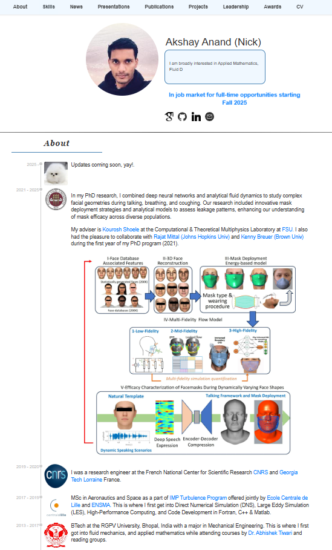

# Akshay Anand's Personal Website

[](https://github.com/anand-me/anand-me.github.io/commits/master)
[](https://anand-me.github.io/)
[](https://opensource.org/licenses/MIT)

## 📌 Overview

This repository hosts my personal academic website showcasing my PhD research, publications, presentations, and projects in Applied Mathematics, Fluid Dynamics, FSI, and Machine Learning.

The website is designed with a clean, responsive interface featuring:
- Interactive research timelines
- Publication listings with citations
- Project showcases with visual elements
- Dynamic skill visualization
- News and updates section
- Awards and leadership highlights

## 🔍 Preview



## 🚀 Features

- **Research Focus**: Applied Mathematics, Fluid Dynamics, FSI, Machine Learning
- **Interactive Elements**: Animated terminal-style research descriptions
- **Dynamic Skill Visualization**: Visual representation of technical skills
- **Responsive Design**: Mobile-friendly layout
- **Publication Integration**: Academic publications with PDF links and BibTeX
- **Project Showcase**: Visual project gallery with detailed descriptions

## 🛠️ Technology Stack

- HTML5 & CSS3
- Vanilla JavaScript
- Font Awesome Icons
- Responsive Design
- CSS Animations

## 📁 Directory Structure

```
.
├── images/               # Website images and project visuals
├── files/                # Downloadable files (CV, etc.)
├── Conferences/          # Conference papers and presentations
│   ├── Papers/           # Published papers
│   ├── BibTex/           # Citation information
│   └── Research/         # Research materials
├── style.css             # Main stylesheet
├── publications.css      # Publications section styling
├── presentations.css     # Presentations section styling
├── projects.css          # Projects section styling
├── awards.css            # Awards section styling
├── leadership.css        # Leadership section styling
├── cv.css                # CV section styling
├── index.html            # Main website file
├── CNAME                 # Custom domain configuration
├── LICENSE               # License information
└── README.md             # This file
```

## 🔧 Setup and Customization

1. Clone the repository:
   ```bash
   git clone https://github.com/anand-me/anand-me.github.io.git
   ```

2. Customize the content in `index.html` with your own information.

3. Preview your changes locally:
   ```bash
   firefox index.html
   ```

4. Update images in the `images/` directory.

5. Deploy to GitHub Pages or your preferred hosting service.

## 📝 Customization Tips

- **Profile Update**: Replace profile information in the "About" section
- **Skills Modification**: Edit the skill levels in each category
- **Publication Addition**: Follow the existing template for adding new publications
- **Project Showcase**: Add new projects following the established structure
- **News Updates**: Keep the "Latest News" section current

## 🔗 Credits

This website draws inspiration from:
- [Andrej Karpathy](https://karpathy.ai/)

## 📄 License

This project is licensed under the MIT License - see the [LICENSE](LICENSE) file for details.

## 📬 Contact

Feel free to reach out for questions, suggestions, or collaborations:
- [LinkedIn](https://www.linkedin.com/in/akshay-anand-fluid-dynamics/)
- [GitHub](https://github.com/anand-me)
- [Google Scholar](https://scholar.google.com/citations?user=s4z1oq8AAAAJ&hl=en)
